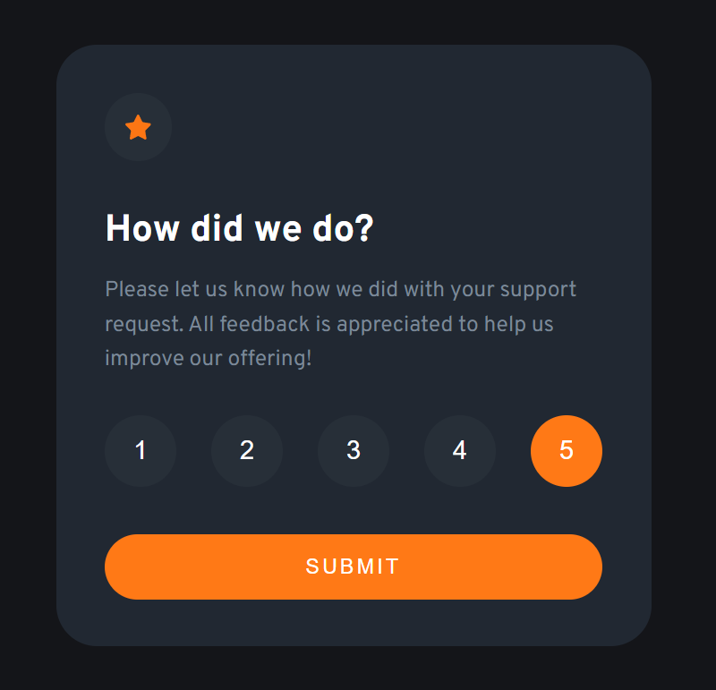
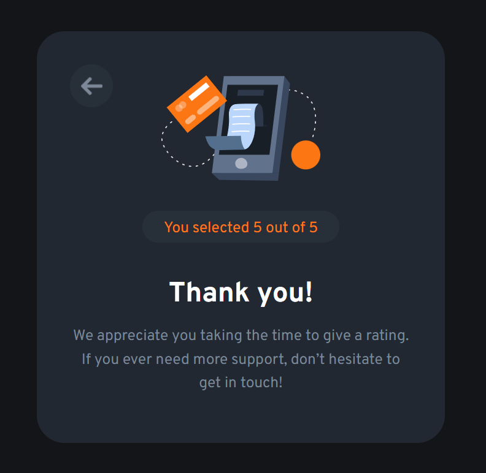

# Frontend Mentor 1 :nerd_face:
## Interactive rating component

This is a nice, small project to practice handling user interactions and updating the DOM. Perfect for anyone who has learned the basics of JavaScript!

**Page Link**: [Link to the page](https://santillan-veterinaria-curso.vercel.app/)

**Linkedin**: [Dylan Santillán](https://www.linkedin.com/in/dylansantillan/)

### Level 
- Newbie 

### Technologies
- HTML 
- CSS
- JS 

### Project Preview :computer:

- Front view: 
- Back view: 

